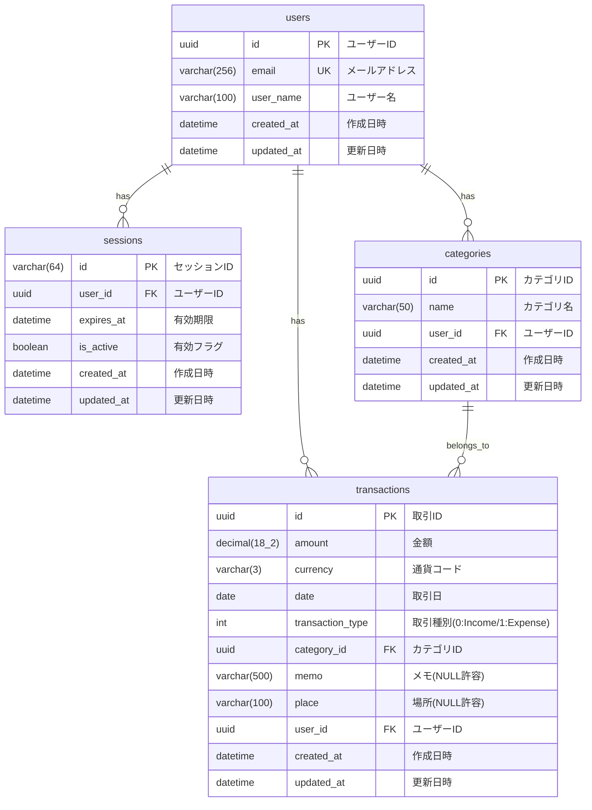

# ER図

## テーブル一覧

| テーブル名 | 説明 |
|-----------|------|
| users | ユーザー情報 |
| sessions | 認証セッション情報 |
| categories | カテゴリ情報 |
| transactions | 取引情報 |

## リレーション

| 親テーブル | 子テーブル | 関係 |
|-----------|-----------|------|
| users | sessions | 1:N |
| users | categories | 1:N |
| users | transactions | 1:N |
| categories | transactions | 1:N |

## インデックス

| テーブル | インデックス | カラム |
|---------|-------------|--------|
| users | ix_users_email | email |
| sessions | ix_sessions_user_id | user_id |
| sessions | ix_sessions_user_id_is_active | user_id, is_active |
| categories | ix_categories_user_id | user_id |
| categories | ix_categories_user_id_name | user_id, name |
| transactions | ix_transactions_user_id | user_id |
| transactions | ix_transactions_user_id_date | user_id, date |
